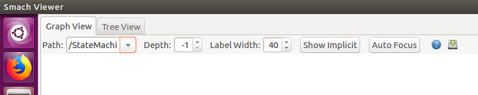

# Creating Smach Viewer outputs
## 1. Step

Press the 'Save' button on the right of the toolbar.
## 2. Step
Find your file, it should be saved in:
```
~/.ros/dotfiles
```

## 3. Step
Optionally you might want to remove a certain state, e.g. an error state that is connected to every other state.
Use the provided `hide_states.py` script.

```sh
usage: hide_states.py [-h] inputfile outputfile filterstring

Hide states from your Smach Viewer.

positional arguments:
  inputfile     the inputfile to process
  outputfile    the filename for the output
  filterstring  the State you want to hide/remove from the dotfile. Enter like
                "/StateMachine/error"

optional arguments:
  -h, --help    show this help message and exit
```
## 4. Step
Use graphviz to export the graph to PNG or SVG.
```sh
dot -Tpng smach_output.dot -o graph.png
```
Instead you can also use this nice Atom Add-on: [graphviz-preview-plus](https://atom.io/packages/graphviz-preview-plus). It offers nice features like exporting the graph to SVG or trying different graph engines using a GUI.
